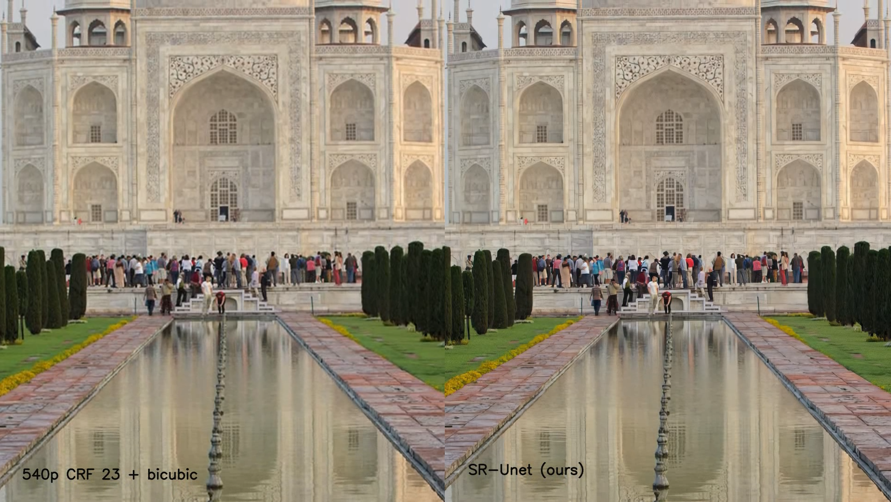
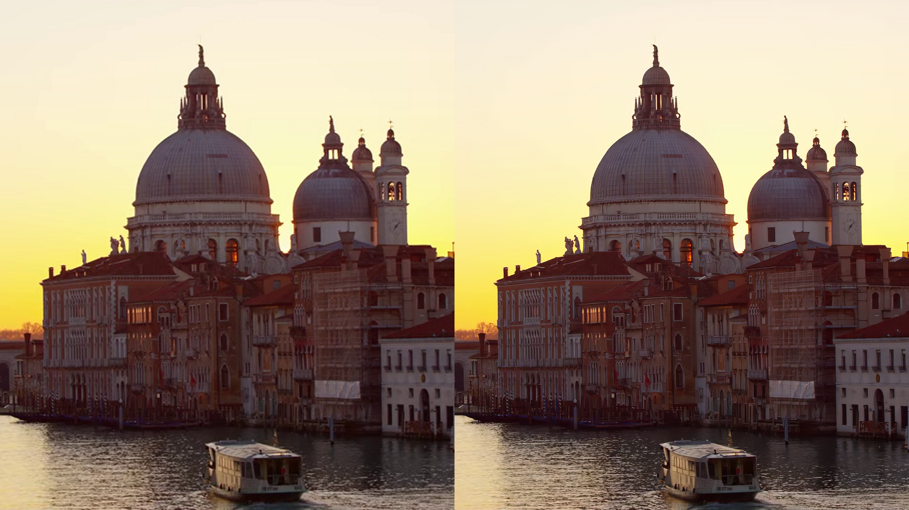

# Fast SR-UNet
This repository contains the implementation of [1]. It is an architecture comprised with a GAN-based training procedure for obtaining 
a fast neural network which enable better bitrate performances respect to the H.265 codec for the same quality, or better quality at the same
bitrate.

#### Requirements:
- Installing CUDA with torchvision and torch: `$ conda install pytorch torchvision cudatoolkit=10.2 -c pytorch -c`
- [LPIPS](https://github.com/richzhang/PerceptualSimilarity): `$ pip install lpips`
- FFMpeg compiled with H.265 codec and also VMAF metric. My version is included in the `helper/` directory but it won't likely work. 
  For references check [the official compilation guide](https://trac.ffmpeg.org/wiki/CompilationGuide/Ubuntu) and 
  the [VMAF GitHub Repository](https://github.com/Netflix/vmaf).
  

#### The dataset:
First, the dataset we use for training is the [BVI-DVC](https://arxiv.org/pdf/2003.13552). For preparing the dataset there are two helper script, 
`compress_train_videos.sh` for spatially compressing and encoding each video, then with `extract_train_frames.sh` the dataset can be prepared.   
The train dataset should follow this naming scheme (assuming the videos are encoded with CRF 23):
```
  [DATASET_DIR]/
      frames_HQ/
          [clipName1]/
              [clipName1]_001.png
              [clipName1]_002.png
              ...
              [clipName1]_064.png
          [clipName2]/
              ...
          [clipNameN]/
              ...
      frames_QF23/
          [clipName1]/
              [clipName1]_001.png
              [clipName1]_002.png
              ...
              [clipName1]_064.png
          [clipName2]/
              ...
          [clipNameN]/
              ...
```
#### Training the model:

To train the SR-ResNet described in the paper for 2x Super Resolution (as used in the model for the 540p -> 1080p upscaling), you can use this command.
```
$ python train.py --arch srunet --device 0 --upscale 2 --export [EXPORT_DIR] \
--epochs 80 --dataset [DATASET_DIR] --crf 23
```
Or, since most of these arguments are defaults, simply 
```
$ python train.py --dataset [DATASET_DIR]
```
For more information about the other parameters, inspect `utils.py` or try
```
& python train.py -h
```

However, in the bandwidth experiments we employed a lighter model, trained on a range of CRFs for performing an easier 1.5x upscale (720p -> 1080p). It is obtainable with the following command:
```
$ python train.py --arch srunet --layer_multiplier 0.7 --n_filters 48 --downsample 0.75 --device 0 \
--upscale 2 --export [EXPORT_DIR] --epochs 80 --dataset [DATASET_DIR] --crf [CRF]
```

#### Testing the models:

You may want to test your models. In our paper we tested on the 1080p clips available from the (Derf's Collection)[https://media.xiph.org/video/derf/]
 in Y4M format.  For preparing the test set (of encoded clips) you can use the `compress_test_videos.sh` helper script.
This time, the test set will be structured as follows, and there is no need of extracting each frame:
```
    [TEST_DIR]/
        encoded540CRF23/
            aspen_1080p.mp4
            crowd_run_1080p50.mp4
            ducks_take_off_1080p50.mp4
            ...
            touchdown_pass_1080p.mp4
        aspen_1080p.y4m
        crowd_run_1080p50.y4m
        ducks_take_off_1080p50.y4m
        ...
        touchdown_pass_1080p.y4m
```
Finally, for testing a model (e.g. the one performing 1.5x upscale) which name is _[MODEL_NAME]_ you can use the command:
```
$ python evaluate_model.py --model [MODEL_NAME] --arch srunet --layer_multiplier 0.7 --n_filters 48 \
--downsample 0.75 --device 0 --upscale 2 --crf 23 --test_dir [TEST_DIR] --testinputres 720 --testoutputres 1080
```
Ultimately will be printed on screen the experimental results, and also will be saved a .csv file contained these infos.

## Examples


Check (this link)[https://bit.ly/3aGPzMW] for the complete clip.  



#### References:
This code is the implementation of my Master Degree Thesis, from which my supervisors and I wrote the paper:
- [1] Fast video visual quality and resolution improvement using SR-UNet.
  Authors Federico Vaccaro, Marco Bertini, Tiberio Uricchio, and Alberto Del Bimbo (accepted at ACM MM '21)